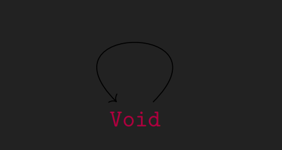
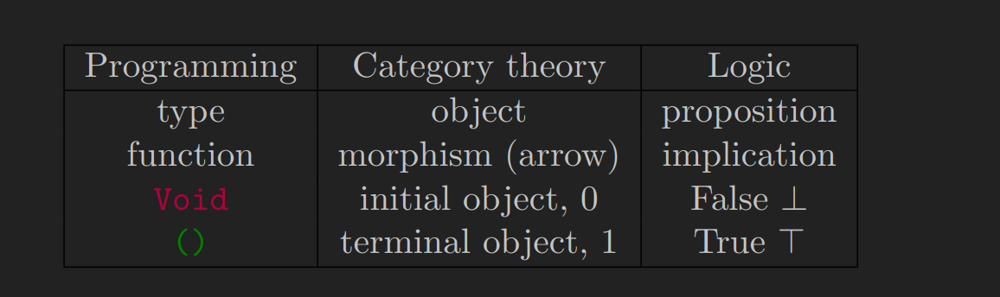

+++
title = "DaoFP 读书笔记 —— Clean Slate"
date = 2023-01-05
[taxonomies]
categories = ["notes"]
tags = ["functional programming"]

+++

> 注：这是我的 [DaoFP](https://github.com/BartoszMilewski/DaoFP) 读书笔记，这本书是拉我入坑的超级巨佬[九零](https://github.com/a9032676)推荐给我的。同时这本书的作者 Bartosz Milewski
> 也是《Category Theory for Programmers》的作者，他也在 Youtube 上传过一系列面向程序员的范畴论教学视频，之前粗略翻了一下感觉书中这种循序渐进的感觉太棒了！所以准备开坑。
>
>我阅读英文文献的方式跟其他人有一些不一样（我是笨蛋垃圾废物脑残）。我会边阅读边把自己已经能理解的东西抄到笔记上加深印象或以供日后翻阅。
>
>我会在尽量理解这些内容的大前提下记笔记，所以我也会将原文没有讲清楚或者需要花费很大力气理解的地方通过自己的话解释清楚，以及如果部分内容不影响理解，我不会将其记录。

## 1.1 Types & Functions

> 你可能有一些对于编程的先入之见，认为编程从类型和函数开始。摆脱它们！它们会使你的脑袋蒙上阴影。
> 不要考虑硬件是怎么实现的，计算机只是众多计算模型的一种，你完全可以只在脑海中或用纸和笔进行计算。它的物理实现层与编程思想无关。

老子可能说过：*类型可道非类型也*，换句话来说：**类型** (Type) 是一种基本概念，它无法被定义。在类型论 (Type Thoery)、范畴论 (Category Thoery) 和逻辑论 (Logic Thoery) 里面它们被称为对象 (
Object) 或命题 (Proposition)。

类型本身没有任何意义，它的特别之处是它如何**连接**到其他的类型。连接由**箭头** (Arrow) 描述。箭头有一种类型作为其来源，有一种类型作为其目标。一个箭头的来源和目标可能是相同的，在此情况下箭头呈环绕状。

可能不止有一种类型，所以我们需要命名。于是我们有了类型 `a`、`b` 还有 `c`。还有类型 `Int`、`Bool` 和 `Double`。

类型之间的箭头被称为**函数** (Function)、对象之间的箭头被称为**态射** (Morphism)、命题之间的箭头被称为**蕴含** (Entailment)
。它们用来描述不同数学领域中的箭头。在逻辑论上，我们将两个对象之间的箭头解释为 `a` 蕴含 `b`。或是 `b` 可从 `a` 导出。

两个类型之间可能不止有一个箭头，这意味着我们同样需要给它们命名。举个例子。下面是类型 `a` 和类型 `b` 之间的箭头，称为 `f`。


你可以说为这个函数 `f` 接收了一个 `a` 类型的参数，产出了类型 `b` 的结果。也可以说是一个若 `a` 为真 (True)，则 `b` 也为真的的证明 `f`。

## 1.2 Yin & Yang

一个对象由其箭头的连接定义，箭头是两个对象相连的事实或证明。有时这里没有证明，则两个对象断开连接；有些时候有很多证明，而有些时候只有一条证明 —— 一根证明两个对象相连的**唯一**箭头。

唯一是什么意思？它符合了下面两个定义：

- 一个对象，它对每一个对象（包括它自己）都有一个唯一的**出射箭头** (Outgoing Arrow)，被称为**始对象** (Initial Object)。
- 一个对象，每一个对象都对它有一个唯一的**传射箭头** (Incoming Arrow)，被称为**终对象** (Terminal Object)。它是始对象的对立面。

在数学上，始对象通常用 `0` 表示，而终对象用 `1` 来表示。

始对象是一切的来源，作为一种类型。它在 Haskell 被称为 `Void`，既然有一个箭头从 `Void` 到万物。所以也有一个从 `Void` 到它自身的箭头。



`Void` 产出了 `Void` 和所有事物。

终对象结合了一切，作为一种类型它被称为 `Unit`。

在逻辑论中，终对象象征着终极真理，以 `T` 或 `>` 为符号。任何对象都有一个指向它的符号，这意味着无论你的假设是什么，`>` 都是真的。另一方面，始对象代表逻辑上的虚假、矛盾或反事实。用一个倒置的
T 来象征，即为 `⊥`。事实上，从它到任何对象都有一个箭头，意味着你可以从错误的前提下尝试证明任何事情。

在英语中，有专门的[语义](https://en.wikipedia.org/wiki/Counterfactual_conditional)用于表述反事实的含义。例 *If wishes were horses, beggars would ride*
这里的意思是当我们把愿望和马划上等号时，乞丐会骑上。但这个大前提是假的。

编程语言能够使我们跟计算机交流。有些语言更容易让人或计算机理解，而有些语言更接近于理论层面。在 Haskell 中，始对象对应名为 `Void` 的类型，而终对象对应名为 `Unit`
的类型。实际用来表示它的名称为 `()` 。

还是在 Haskell 中，有无数的类型。而每一个类型都有一个从 `Void` 类型到它们的出射函数，这个函数被称为 `absurd`。



## 1.3 Elements

一个对象内部可能没有东西，但它可能有结构，结构是由指向该对象的传射箭头定义的。

在编程中，我们希望我们的始对象没有结构，所以我们假设它没有传射箭头（除了到它自身的除外, `Void -> Void`）。因此 `Void`
没有结构，而终对象只有从任何对象到它的传射箭头。从任何方向都只有一种探测它的方法，这个角度看终对象就像一个不可分割的点。它的唯一属性就是它存在，其他指向它的传射箭头证明了这一点。

我们还可以用终对象去探测其他更为复杂的对象，如果有一个以上的箭头从终对象到某个对象 `a`。这意味着 `a` 有一些结构，有不止一种方式来看看待它。终对象的行为就像是一个点，我们可以把来自它的每一个箭头看作是挑选目标的一个不同的点或元素。

在范畴论中，如果 `x` 是一个箭头的话，我们把它看作是 `a` 的一个全局元素 (Global Element)。（通常我们会省略 “全局”）


> 这里的 `1` 指终对象。

在类型论中，`x : A` 意味着 `x` 是 `A` 类型的，在 Haskell 中，使用双冒号的符号来进行代替。

```haskell
x :: A
```

或者你还可以这样，虽然在类型系统上它们有所区分，但在范畴论的语义上它们是一样的。

```haskell
x :: () -> A
```

在范畴论的角度上讲，我们把它解释成一个 `x : 1 -> A` 的箭头，`A` 的一个元素。

由于我们没有规定其他对象到 `Void` (始对象) 的箭头，所以也没有从终对象到它的箭头。因此 `Void`
没有任何元素，这也就是为什么我们认为它是没有结构。而终对象只有一个元素，因为它有一个唯一的来自它自己的箭头 (`1 -> 1`)。这就是为什么我们有时称它为单例 (Singleton)。

> 范畴论中并不禁止始对象拥有来自其他对象的传射箭头，但是这里我们所研究的[笛卡儿闭范畴](https://en.wikipedia.org/wiki/Cartesian_closed_category) (Cartesian Closed Category) 中，这是不允许的。

## 1.4 The Object of Arrows

两个对象之间的箭头可以构成一个集合。在 Haskell 中从类型 `a` 到类型 `b` 的函数可以这么写：

```haskell
f :: a -> b
```

可以解释为 `f` 是 “从 `a` 到 `b` 的函数” 类型，在这里我们给这种函数 (`a -> b`) 看作是一个类型。

如果我们希望这种函数类型与其他类型被一样看待的话，我们就需要一个对象来表示一组从 `a` 到 `b` 的箭头。为了完全定义这一点，我们必须描述它跟其他对象的关系。特别是在 `a` 和 `b` 之间。
为了做到这一点，我们需要区别它们，一方面我们有用来连接两个对象 `a` 和 `b` 的箭头，这些箭头形成一组。另一方面我们有一个从 `a` 到 `b` 的箭头对象，作为元素它是一个从终对象到 `a -> b`
对象的箭头。
编程中使用的符号往往会模糊这种区别，这也就是为什么在范畴论中我们把箭头指向的对象写成**指数**并将其写为 bᵃ。（源对象在指数中）


在逻辑论里面，一个 `a -> b` 的箭头说明了这样一个事实：“如果 `a` 那么 `b`”。一个指数对象 bᵃ 是相应的命题，可真可假，我们不知道。它的证明是 bᵃ
里的一个元素，如果这么一个元素存在，我就知道 `b` 是由 `a` 引出的。

再思考一下 *If wishes were horses, beggars would ride* 这一陈述，这次是作为一个对象，你可以尝试证明它。

写一些类似的东西：一个有马的人就会骑马，乞丐有愿望，既然愿望是马，乞丐就有马。因此乞丐会骑马。但是即使你有这段陈述的证明也没有用，因为你永远无法证明它的前提。愿望 = 马。