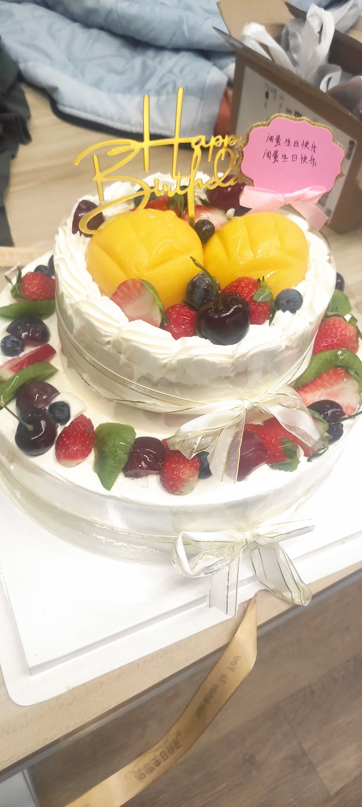

+++
title = "2022 总结"
date = 2022-12-12
[taxonomies]
categories = ["life"]
tags = ["碎碎念"]

+++

> 2022 很快就过去了，而在这一年在我身上也发生了很多事，所以我打算记录一下。

## 成人

在樱游互娱度过了我的 18 岁生日，其实之前的生日都是凑合过的，家里人也几乎没有庆祝过子女的生日（除了给长辈过）。

上午的时候还在公司写代码，等 Gitlab 流水线构建测试的时候突然想到自己今天生日，所以就外卖送了个蛋糕，也算是一种报复心理吧。

  

随着年龄的增大自己也开始慢慢恐慌，已经决定走这条路了，如果等到大学毕业后我还是这么菜怎么办？这样的人有什么资格以自己的 “编程” 技能自信？这种想法一直笼罩着我，期间也找过很多大佬交流过，但对我来说摆脱这种想法的唯一选择就是变强。我不甘于什么都不会的自己。

## 离职

在今年的九月份，我负责参与的[项目](https://github.com/Eternalland-Server)因故被砍，正好我也需要参加高中的会考考试才能拿到高中毕业证，所以选择了从樱游互娱离职。

在此期间，[阿伟](https://github.com/xxxijustwei)作为主程一直都有关照我很多，在工作期间也出过很多糗事。在中后期项目主策筒子因肺结核住院转线上办公导致我出现了些许摆烂心理，这些都是我一直以来的缺点，但在樱游互娱的这段时间无异是我迄今为止人生当中最快乐的一段时光。我非常感谢他们和樱花。

希望以后有缘再见的时候，会让你们看到一个更好更牛逼的自己。

## 未来

既然想要变强，那就要做出行动。[Marisa](https://github.com/MarisaKirisame) 安利我去学 `CS61A`，目前也在进行中。等学完之后我想重新继续学习 `Haskell`。当我还在樱游互娱的时候将 `Learn You A  Haskell For Great Good` 和 `Real World Haskell` 混着看算勉强入了门，但并没有更深入的去了解 `Applicative`、各式各样的 `Monad` 等只有在 `Haskell` 等函数式系语言中才有的东西（我觉得可以称为 “思维”）。当时因为实在非常忙就没有继续填坑，这次辞职之后除了一月份的高中会考以外，到明年大学 （大专）开学都是空档期。我可以专注于这些事情。

我并不打算参加国内高考，原因是我是河南最后一届大文生。哪怕自己最后非常努力考上了本科也无法读计算机相关的专业。而且我也失去了继续读的兴趣，特别是在一个重点班的朋友在微信告诉我他上本科都够呛的话后。河南大部分高中（尤其是县城）的教育资源还是匮乏的，只能靠嗯卷来弥补差距。他们每天早上五点起床十点下晚自习一个月放一次假，他们对未来满怀期盼，他们都是优秀的学生。但独木桥上不能容纳所有人，在这里同时也祝我曾经的同学们好运。

在 `Minecraft` 上的投入大概也会减少，现在唯一还在做跟 `Minecraft` 相关的事情就是写插件赚钱。前几年跟朋友们开服的经历无疑是宝贵的，但很明显结果投入不成正比。我至今也在后悔为什么前几年自己没有做我现在做的事情，但最后也释然了。因为到最后我多了好几位认识好几年的铁哥们儿，也许我们的友谊将持续一生？谁知道呢。

最后就以曾经我在 QQ 空间发过的话结尾吧：

> 愿你的野心，不会伴随着懒惰与现实而凋落。
